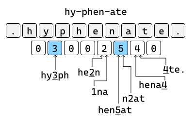

# How to put 30 languages into 1.1MB

_This blog post is about [`hypher`], a fast hyphenation library for Rust._

I'm currently working on a pure-rust LaTeX alternative called [Typst].
To obtain justification results on par with LaTeX, Typst needs support for hyphenation.
A quick search on [docs.rs] showed that there's only really one hyphenation library, fittingly called [`hyphenation`].
All other crates I've found were small variations of this crate.
The `hyphenation` crate has a lot of functionality and supports many languages.
However, it also has sizable binary overhead when you embed the hyphenation patterns (2.8MB).
While you can load patterns at runtime, distributing the pattern files separately is so much more complicated than just embedding them.

A specific pain point I had with `hyphenation` was that I needed to hold on to the loaded, heap-allocated language dictionaries.
In my case, the text was pre-segmented into "words" (string segments between two [Unicode line break opportunities][unicode-linebreak]) and the language could be different for each word.
Thus, I would've either had to reload the patterns for each word (slow) or set up some caching solution.
Which is certainly possible, but I had some problems getting it to work because the hyphenating iterator kept borrows into the caching hash map.

So, at this point I decided to build a new crate with the following goals:
No allocations, no loading at runtime, less binary overhead and no dependencies (why not).
It looks like this:

```rust
use hypher::{hyphenate, Lang};

let syllables = hyphenate("extensive", Lang::English);
assert_eq!(syllables.join("-"), "ex-ten-sive");
```

(And that's almost the whole API surface.)

## Hyphenating words
So, how do we actually hyphenate stuff?
Turns out that there aren't really lists of hyphenated words that are available for free.
So even with a new, let's say ML-based algorithm, we would still miss the data to make it work.
(Such an approach would definitely be interesting, although I'm guessing the models would be quite large.)
After a bit of research, it seemed that using TeX patterns is still the way to go.
TeX patterns are, in principle, generated from word lists with the [patgen] tool, but many were tweaked by native speakers over the decades.
The algorithms for dealing with the patterns go all the way back to Liang's 1983 thesis [_Word Hy-phen-a-tion by Com-put-er_][liang-thesis].

The general idea of the patterns is the following:
There are _hyphenating_ and _inhibiting_ patterns.
A hyphenating pattern says something like "if you see this sequence of letters, you can hyphenate here".
An inhibiting pattern is the opposite: "If you see this sequence, don't hyphenate here!"
There are multiple levels of each kind:
The first level of hyphenating patterns defines broad, general rules like "you can hyphenate between two successive 'c's."
The first level of inhibiting patterns handles exceptions from this rule.
And, you guessed it, the second level of hyphenating patterns handles the exceptions of the exceptions.

The pattern files are encoded in a simple text format:
Letters are just letters and a number between two letters designates a point of hyphenation or inhibition.
Odd numbers specify hyphenations and even numbers inhibitions and the numbers max out at 9.
Some pattern include dots to indicate that the pattern should only match at the start or end of the word.

Now, to find out how to hyphenate a word, we first need a zero-initialized array of levels with length one less than that of the word (one entry for each point between two letters).
Then, we need to find all patterns that match a substring of our word and update the level array with their levels.
Updating always means taking the maximum of the existing entry and the number in the pattern, so that in the end, we get the result of the strongest pattern.
Finally, the possible hyphenation points lie at the odd levels in the array.



## Encoding patterns efficiently
So far so good.
We know the general idea, but an important question remains:
How do we find all matching patterns?
While we could store the patterns in a hashmap and iterate over all substrings in quadratic time, this would kind of defeat the point of this blog post.
_We want performance._

Luckily, Liang's thesis also contains efficient algorithms to work with the patterns.
We can encode the patterns into a finite state machine and then efficiently traverse that machine at runtime.

TODO:
- Suffix compression turns it into a DFA
- Binary encoding inspired by [`regex-automata`]
- More efficient variable length delta address encoding

Up until now we use one byte for the `distance` and one for the `level`.
Let's cramp those two into a single byte.
It turns out that there is no `distance` larger than 24 and no `level` larger than 9 in the patterns.
We can't directly shift and bitor these two values into 8 bits (distance would need 5 bits and level 4 bits).
However, there are still only 25 * 10 = 250 combinations, which is less than 256. So we can fit it into one byte like this:

```rust
fn pack(dist: u8, level: u8) -> u8 {
  assert!(dist < 25, "too high distance");
  assert!(level < 10, "too high level");
  dist * 10 + level
}

fn unpack(packed: u8) -> (u8, u8) {
  let dist = packed / 10;
  let level = packed % 10;
  (dist, level)
}
```

## Finishing up
At runtime, we now don't need to prepare or load anything.
We can just lazily decode the embedded automaton as we're executing it.
And to eliminate the last allocation, we can even stack allocate the level array if the word isn't too long (<= 39 bytes in `hypher`).

Regarding API, I opted for a free-standing method `hyphenate(&str, Lang) -> Syllables` as I feel that it is much more discoverable than a method on `Lang`.
`Syllables` is a hand-written iterator that segments the string based on the level array.
I also always enjoy when a crate makes my job as simple as a possible.
Therefore, I added a `join` method to `Syllables` so that you quickly add in some (soft) hyphens.

As the build script really took its time in debug builds, I added this to my `Cargo.toml` to somewhat optimize the build script:

```toml
[profile.dev.build-override]
opt-level = 1
```

Regarding binary size:
1.1MB isn't that much, but there are also many applications where you only want to hyphenate English.
For this, I added two features `full` and `english` with `full` being enabled by default.
Dropping `all` and adding `english` brings the overhead down to 27KB.
While I don't think its great to favor English like that (I'm not a native English speaker), I also felt that adding one feature per language didn't carry its weight.

```toml
[features]
default = ["full"]
full = ["english"]
english = []
```

## Benchmarks
- Zero start-up time
- Zero allocations
- About 2x as fast as hyphenation :)
- TODO: Fair binary size comparison which just the languages hypher
  also supports

It is of notice that I wanted `hypher` to be permissively licensed.
Therefore, it unfortunately does not support languages for which the only available patterns have GPL-like licenses.
There are a few of those, but not too many.

Posted on [r/rust].
Have a look at Typst [here][Typst] if you're interested.

[r/rust]: https://reddit.com/r/rust
[`hypher`]: https://github.com/typst/hypher
[`hyphenation`]: https://github.com/tapeinosyne/hyphenation
[`regex-automata`]: https://github.com/BurntSushi/regex-automata
[docs.rs]: https://docs.rs
[Typst]: https://typst.app
[unicode-linebreak]: https://unicode.org/reports/tr14/
[patgen]: https://ctan.org/pkg/patgen?lang=de
[liang-thesis]: https://tug.org/docs/liang/liang-thesis.pdf
